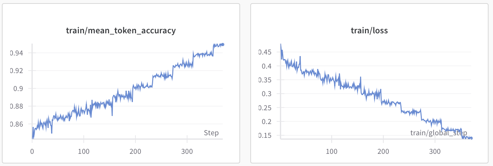
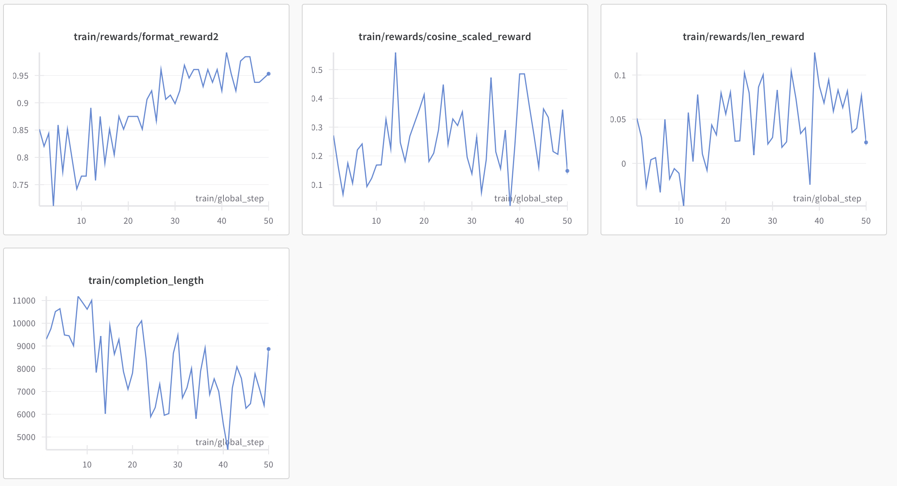
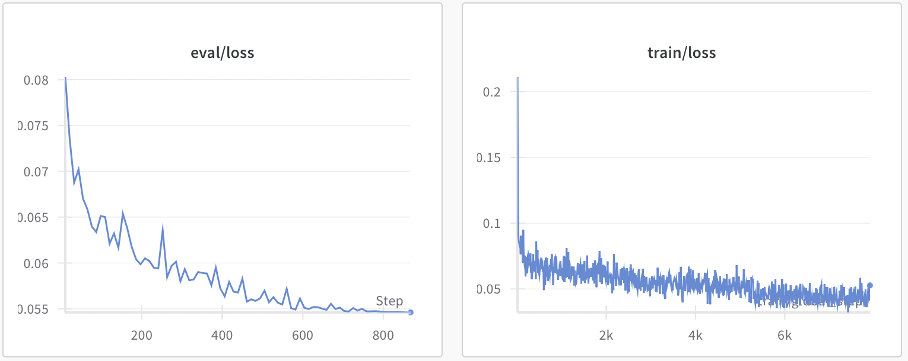

# Kaggle AI Mathematical Olympiad - Progress Prize 2 - 9th Place Solution (Fast-Math-R1-14B)
## Team
- Hiroshi Yoshihara @ [Aillis Inc.](https://aillis.jp/en), [The Univ. of Tokyo](https://publichealth.f.u-tokyo.ac.jp/#page_home)
- Yuichi Inoue @ [Sakana AI](https://sakana.ai)
- Taiki Yamaguchi @ [Rist Inc.](https://www.rist.co.jp/en/)

# Summary
By applying SFT and GRPO on difficult math problems, we enhanced the performance of `DeepSeek-R1-Distill-Qwen-14B` and developed `Fast-Math-R1-14B`, 
which achieves up to 60% (on average approx. 30%) faster inference while maintaining accuracy.


|                              |              | AIME 2024        |               | AIME 2025        |               | 
| ---------------------------- | ------------ | ---------------- | ------------- | ---------------- | ------------- | 
| Model                        | Token budget | Pass@1 (avg. 64) | Output tokens | Pass@1 (avg. 64) | Output tokens | 
| DeepSeek-R1-Distill-Qwen-14B | 16384        | 63.3             | 9590          | 46.7             | 10602         | 
|                              | 12800        | 58               | 8632          | 41.9             | 9363          | 
|                              | 8192         | 45.6             | 6638          | 30.6             | 6897          | 
| Light-R1-14B-DS              | 16384        | **66.8**             | 10146         | **51.3**             | 11308         | 
|                              | 12800        | 59.2             | 9110          | 43.8             | 9834          | 
|                              | 8192         | 42.4             | 7020          | 30.4             | 7124          | 
| Fast-Math-R1-14B             | 16384        | 66               | **7932**          | 49.2             | **9066**          | 
|                              | 12800        | **63**               | **7449**          | **46.1**             | **8282**          | 
|                              | 8192         | **51.4**             | **5963**          | **37.2**             | **6256**          | 
| Fast-Math-R1-14B-SFT Only    | 16384        | 65.2             | 10268         | 49.7             | 11264         | 
|                              | 12800        | 57.2             | 9180          | 42.8             | 9805          | 
|                              | 8192         | 41.3             | 7015          | 30.1             | 7074          | 


# Download
- `Fast-Math-R1-14B` model is available at [Huggingface](https://huggingface.co/RabotniKuma/Fast-Math-R1-14B) and [Kaggle Models](https://www.kaggle.com/models/analokamus/fast_math_r1_14b/).
- [First stage SFT dataset](https://huggingface.co/datasets/RabotniKuma/Fast-Math-R1-SFT)
- [Second stage GRPO dataset](https://huggingface.co/datasets/RabotniKuma/Fast-Math-R1-GRPO)
- (Optional) [Token scheduler dataset](https://huggingface.co/datasets/RabotniKuma/Fast-Math-R1-Token-Scheduler)

# Training models
## 1. Installation
```bash
poetry lock
poetry install --no-root
```

## 2. First stage training
Training time: approx. 10 hours (8× H200 GPUs)
```bash
CUDA_VISIBLE_DEVICES=0,1,2,3,4,5,6,7 \
    accelerate launch --config_file accelerate_configs/deepspeed_zero3.yaml --num_processes 8 \
    experiments/train_first_stage.py
```


## 3. Second stage training
Training time: approx. 10 hours (8× H200 GPUs)
```bash
CUDA_VISIBLE_DEVICES=0,1,2,3,4,5,6,7 \
    accelerate launch --config_file accelerate_configs/deepspeed_zero2.yaml --num_processes 8 \
    experiments/train_second_stage.py
```



## (Optional) Token scheduler training
Training time: approx. 1 hours (8× H200 GPUs)

The token scheduler is a lightweight model that predicts the difficulty of a problem, measured by how many tokens the R1 model requires before reaching the final answer. See [Kaggle discussion](https://www.kaggle.com/competitions/ai-mathematical-olympiad-progress-prize-2/discussion/571252) for details.
```bash
CUDA_VISIBLE_DEVICES=0,1,2,3,4,5,6,7 \
    accelerate launch --config_file accelerate_configs/deepspeed_zero3.yaml --num_processes 8 \
    experiments/train_token_scheduler.py
```



# Inference
## vLLM
```python
from vllm import LLM, SamplingParams


vllm_engine = LLM(
    model='RabotniKuma/Fast-Math-R1-14B',
    max_model_len=8192,
    gpu_memory_utilization=0.9,
    trust_remote_code=True,
)
sampling_params = SamplingParams(
    temperature=1.0,
    top_p=0.90,
    min_p=0.05,
    max_tokens=8192,
    stop='</think>',  # Important early stop at </think> to save output tokens
)
vllm_engine.generate('1+1=', sampling_params=sampling_params)
```

# Technical details
Detailed report is available on [Kaggle Disucussion](https://www.kaggle.com/competitions/ai-mathematical-olympiad-progress-prize-2/discussion/571252).

## First stage: intensive SFT using a high-difficulty dataset
### Dataset
- [OpenR1 Math](https://huggingface.co/datasets/open-r1/OpenR1-Math-220k): We randomly sampled 3000 examples where the R1’s trace had more than 12800 tokens and an accuracy of over 50%, along with another 3000 examples where the accuracy ranged between 50% and 75%.
- [openr1_hard](https://huggingface.co/datasets/hoanganhpham/openr1_hard):  "~2.5k hard samples from open-r1-math-220k. Samples deemed as hard were unsolvable by r1-distill-32b after 4 tries."
- [Light-R1-SFTData](https://huggingface.co/datasets/qihoo360/Light-R1-SFTData): We used the 2nd stage data from Light-R1-SFTData.

We merged all the datasets mentioned above, removed duplicates, and selected the correct generation with the shortest token length. For samples in the Light-R1 dataset where ground truth answers were not provided, we extracted and substituted the answers from the R1 traces. As a result, we constructed a **high-difficulty dataset consisting of 7900 problem - R1 trace - answer sets**.

[Our first stage SFT dataset](RabotniKuma/Fast-Math-R1-SFT)

### Training
A full-parameter supervised fine-tuning training was conducted on a machine with 8 H200 GPUs, using the SFTTrainer from the trl library.

## Second stage: GRPO for more efficient reasoning
### Dataset
- [Light-R1-SFTData](https://huggingface.co/datasets/qihoo360/Light-R1-SFTData): We extracted the answers from the 2nd stage SFT data of Light-R1.

[Our second stage GRPO dataset](https://huggingface.co/datasets/RabotniKuma/Fast-Math-R1-GRPO)

### Training
We used the [faster implementation of trl GRPOTrainer](https://github.com/nhannguyen2709/open-r1).

Reward functions:
1. Format reward

In order to save output tokens, we forced the model to give an answer in the end of reasoning block before `</think>` by rewarding the pattern `r"^.*?oxed{(.*?)}.*?</think>.*?$"`. Generation is stopped at `</think>` during inference.

2. Cosine reward

Compared to a normal accuracy-based reward, cosine reward applies a continuous penalty to longer correct reasoning traces and shorter incorrect ones.

3. Length reward

Length-based rewards to discourage overthinking and promote token efficiency.
Paper: https://arxiv.org/abs/2501.12599
