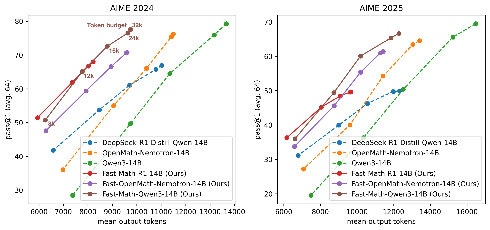

# Kaggle AI Mathematical Olympiad - Progress Prize 2 - 9th Place Solution (Fast-Math-R1-14B)
## Team
- Hiroshi Yoshihara @ [Aillis Inc.](https://aillis.jp/en), [The Univ. of Tokyo](https://publichealth.f.u-tokyo.ac.jp/#page_home)
- Yuichi Inoue @ [Sakana AI](https://sakana.ai)
- Taiki Yamaguchi @ [Rist Inc.](https://www.rist.co.jp/en/)

# Summary
Paper: [A Practical Two-Stage Recipe for Mathematical LLMs: Maximizing Accuracy with SFT and Efficiency with Reinforcement Learning](https://arxiv.org/abs/2507.08267) (Presented at ICML2025 AI for Math Workshop)


By applying SFT and GRPO on difficult math problems, we enhanced the performance of `DeepSeek-R1-Distill-Qwen-14B` and developed `Fast-Math-R1-14B`, 
which achieves up to 60% (on average approx. 30%) faster inference while maintaining accuracy.

In addition, we trained and open-sourced `Fast-OpenMath-Nemotron-14B`, an efficiency-optimized version of NVIDIA’s `OpenMath-Nemotron-14B`, following the same approach.

## Performance comparison


### DS-R1-Qwen-14B vs Fast-Math-R1-14B (Ours)
|                              |              | AIME 2024        |                    | AIME 2025        |                    | 
| ---------------------------- | ------------ | ---------------- | ------------------ | ---------------- | ------------------ | 
| Model                        | Token budget | Pass@1 (avg. 64) | Mean output tokens | Pass@1 (avg. 64) | Mean output tokens | 
| DeepSeek-R1-Distill-Qwen-14B | 32000        | 66.9             | 11026              | 49.9             | 12310              | 
|                              | 24000        | 65.7             | 10784              | 49.7             | 11978              | 
|                              | 16000        | 61               | 9708               | 46.2             | 10567              | 
|                              | 12000        | 53.7             | 8472               | 39.9             | 9008               | 
|                              | 8000         | 41.8             | 6587               | 31.1             | 6788               | 
| Fast-Math-R1-14B             | 32000        | 68               | 8217               | 49.6             | 9663               | 
|                              | 24000        | 67.9             | 8209               | 49.6             | 9627               | 
|                              | 16000        | 66.7             | 8017               | 48.4             | 9083               | 
|                              | 12000        | 61.9             | 7362               | 45.2             | 8048               | 
|                              | 8000         | 51.4             | 5939               | 36.3             | 6174               | 

### OpenMath-Nemotron-14B vs Fast-OpenMath-Nemotron-14B (Ours)
|                            |              | AIME 2024        |                    | AIME 2025        |                    | 
| -------------------------- | ------------ | ---------------- | ------------------ | ---------------- | ------------------ | 
| Model                      | Token budget | Pass@1 (avg. 64) | Mean output tokens | Pass@1 (avg. 64) | Mean output tokens | 
| OpenMath-Nemotron-14B      | 32000        | 76.2             | 11493              | 64.5             | 13414              | 
|                            | 24000        | 75.4             | 11417              | 63.4             | 13046              | 
|                            | 16000        | 66               | 10399              | 54.2             | 11422              | 
|                            | 12000        | 55               | 9053               | 40               | 9609               | 
|                            | 8000         | 36               | 6978               | 27.2             | 7083               | 
| Fast-OpenMath-Nemotron-14B | 32000        | 70.7             | 9603               | 61.4             | 11424              | 
|                            | 24000        | 70.6             | 9567               | 60.9             | 11271              | 
|                            | 16000        | 66.6             | 8954               | 55.3             | 10190              | 
|                            | 12000        | 59.4             | 7927               | 45.6             | 8752               | 
|                            | 8000         | 47.6             | 6282               | 33.8             | 6589               | 

### Qwen3-14B vs Fast-Math-Qwen3-14B
|                     |              | AIME 2024        |                    | AIME 2025        |                    | 
| ------------------- | ------------ | ---------------- | ------------------ | ---------------- | ------------------ | 
| Model               | Token budget | Pass@1 (avg. 64) | Mean output tokens | Pass@1 (avg. 64) | Mean output tokens | 
| Qwen3-14B           | 32000        | 79.3             | 13669              | 69.5             | 16481              | 
|                     | 24000        | 75.9             | 13168              | 65.6             | 15235              | 
|                     | 16000        | 64.5             | 11351              | 50.4             | 12522              | 
|                     | 12000        | 49.7             | 9746               | 36.3             | 10353              | 
|                     | 8000         | 28.4             | 7374               | 19.5             | 7485               | 
| Fast-Math-Qwen3-14B | 32000        | 77.6             | 9740               | 66.6             | 12281              | 
|                     | 24000        | 76.5             | 9634               | 65.3             | 11847              | 
|                     | 16000        | 72.6             | 8793               | 60.1             | 10195              | 
|                     | 12000        | 65.1             | 7775               | 49.4             | 8733               | 
|                     | 8000         | 50.7             | 6260               | 36               | 6618               | 


# Download
- `Fast-Math-R1-14B` model is available at [Huggingface](https://huggingface.co/RabotniKuma/Fast-Math-R1-14B) and [Kaggle Models](https://www.kaggle.com/models/analokamus/fast_math_r1_14b/).
- `Fast-OpenMath-Nemotron-14B` model is available at [Huggingface](https://huggingface.co/RabotniKuma/Fast-OpenMath-Nemotron-14B)
- `Fast-Math-Qwen3-14B` model is available at [Huggingface](https://huggingface.co/RabotniKuma/Fast-Math-Qwen3-14B)
- [First stage SFT dataset](https://huggingface.co/datasets/RabotniKuma/Fast-Math-R1-SFT)
- [Second stage GRPO dataset](https://huggingface.co/datasets/RabotniKuma/Fast-Math-R1-GRPO)
- (Optional) [Token scheduler dataset](https://huggingface.co/datasets/RabotniKuma/Fast-Math-R1-Token-Scheduler)

# Training models
## 1. Installation
```bash
poetry lock
poetry install --no-root
```

## 2. First stage training
Training time: approx. 10 hours (8× H200 GPUs)
```bash
CUDA_VISIBLE_DEVICES=0,1,2,3,4,5,6,7 \
    accelerate launch --config_file accelerate_configs/deepspeed_zero3.yaml --num_processes 8 \
    experiments/train_first_stage.py
```


## 3. Second stage training
Training time: approx. 10 hours (8× H200 GPUs)
```bash
CUDA_VISIBLE_DEVICES=0,1,2,3,4,5,6,7 \
    accelerate launch --config_file accelerate_configs/deepspeed_zero2.yaml --num_processes 8 \
    experiments/train_second_stage.py
```


## (Optional) Token scheduler training
Training time: approx. 1 hours (8× H200 GPUs)

The token scheduler is a lightweight model that predicts the difficulty of a problem, measured by how many tokens the R1 model requires before reaching the final answer. See [Kaggle discussion](https://www.kaggle.com/competitions/ai-mathematical-olympiad-progress-prize-2/discussion/571252) for details.
```bash
CUDA_VISIBLE_DEVICES=0,1,2,3,4,5,6,7 \
    accelerate launch --config_file accelerate_configs/deepspeed_zero3.yaml --num_processes 8 \
    experiments/train_token_scheduler.py
```


## (Optional) Fast-OpenMath-Nemotron-14B
Training time: approx. 12 hours (8× H200 GPUs)
```bash
CUDA_VISIBLE_DEVICES=0,1,2,3,4,5,6,7 \
    accelerate launch --config_file accelerate_configs/deepspeed_zero3.yaml --num_processes 8 \
    experiments/train_fast_nemotron_14b.py
```

## (Optional) Fast-Math-Qwen3-14B
Training time: approx. 12 hours (8× H200 GPUs)

**Note:** You’ll need to update your dependencies to train any of the Qwen3 series models.
```bash
# Update environment
cp dev/pyproject_qwen3.toml pyproject.toml
poetry lock
poetry install --no-root
# Train
CUDA_VISIBLE_DEVICES=0,1,2,3 \
    accelerate launch --config_file accelerate_configs/deepspeed_zero3_cpu_offload.yaml --num_processes 4 \
    experiments/train_fast_qwen3_14b.py &
CUDA_VISIBLE_DEVICES=4,5,6,7 trl vllm-serve --model Qwen/Qwen3-14B --tensor_parallel_size 2 --data_parallel_size 2 &
wait
```


# Inference
## vLLM
```python
from vllm import LLM, SamplingParams
from transformers import AutoTokenizer


model_path = 'RabotniKuma/Fast-Math-R1-14B'
vllm_engine = LLM(
    model=model_path,
    max_model_len=8192,
    gpu_memory_utilization=0.9,
    trust_remote_code=True,
)
tokenizer = AutoTokenizer.from_pretrained(model_path)


sampling_params = SamplingParams(
    temperature=1.0,
    top_p=0.90,
    min_p=0.05,
    max_tokens=8192,
    stop='</think>',  # For even faster inference, applying early stopping at the </think> tag and extracting the final boxed content is recommended.
)
messages = [
    {
        'role': 'user', 
        'content': (
            'Solve the problem, and put the answer in \boxed{{}}. '
            'Sarah is twice as old as her youngest brother. If the difference between their ages is 15 years. How old is her youngest brother?'
        )
    }
]
messages = tokenizer.apply_chat_template(
    conversation=messages,
    tokenize=False,
    add_generation_prompt=True
)
response = vllm_engine.generate(messages, sampling_params=sampling_params)
```

# Technical details
Detailed report is available on [Kaggle Disucussion](https://www.kaggle.com/competitions/ai-mathematical-olympiad-progress-prize-2/discussion/571252).

## First stage: intensive SFT using a high-difficulty dataset
### Dataset
- [OpenR1 Math](https://huggingface.co/datasets/open-r1/OpenR1-Math-220k): We randomly sampled 3000 examples where the R1’s trace had more than 12800 tokens and an accuracy of over 50%, along with another 3000 examples where the accuracy ranged between 50% and 75%.
- [openr1_hard](https://huggingface.co/datasets/hoanganhpham/openr1_hard):  "~2.5k hard samples from open-r1-math-220k. Samples deemed as hard were unsolvable by r1-distill-32b after 4 tries."
- [Light-R1-SFTData](https://huggingface.co/datasets/qihoo360/Light-R1-SFTData): We used the 2nd stage data from Light-R1-SFTData.

We merged all the datasets mentioned above, removed duplicates, and selected the correct generation with the shortest token length. For samples in the Light-R1 dataset where ground truth answers were not provided, we extracted and substituted the answers from the R1 traces. As a result, we constructed a **high-difficulty dataset consisting of 7900 problem - R1 trace - answer sets**.

[Our first stage SFT dataset](RabotniKuma/Fast-Math-R1-SFT)

### Training
A full-parameter supervised fine-tuning training was conducted on a machine with 8 H200 GPUs, using the SFTTrainer from the trl library.

## Second stage: GRPO for more efficient reasoning
### Dataset
- [Light-R1-SFTData](https://huggingface.co/datasets/qihoo360/Light-R1-SFTData): We extracted the answers from the 2nd stage SFT data of Light-R1.

[Our second stage GRPO dataset](https://huggingface.co/datasets/RabotniKuma/Fast-Math-R1-GRPO)

### Training
We used the [faster implementation of trl GRPOTrainer](https://github.com/nhannguyen2709/open-r1).

Reward functions:
1. Format reward

In order to save output tokens, we forced the model to give an answer in the end of reasoning block before `</think>` by rewarding the pattern `r"^.*?oxed{(.*?)}.*?</think>.*?$"`. Generation is stopped at `</think>` during inference.

2. Cosine reward

Compared to a normal accuracy-based reward, cosine reward applies a continuous penalty to longer correct reasoning traces and shorter incorrect ones.

3. Length reward

Length-based rewards to discourage overthinking and promote token efficiency.
Paper: https://arxiv.org/abs/2501.12599
